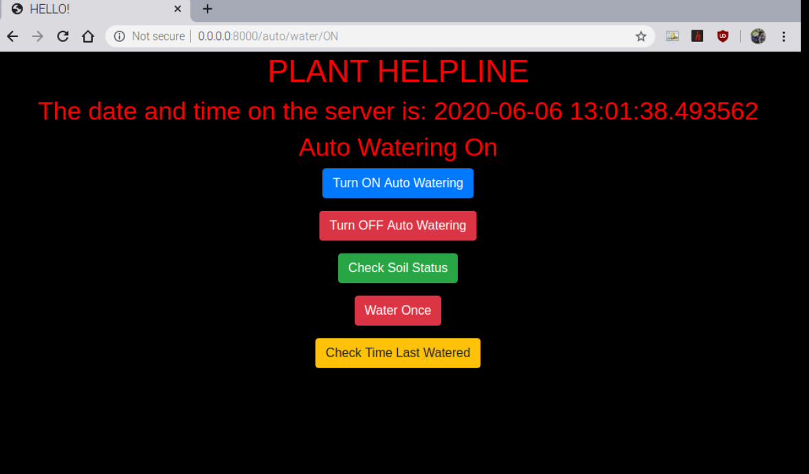
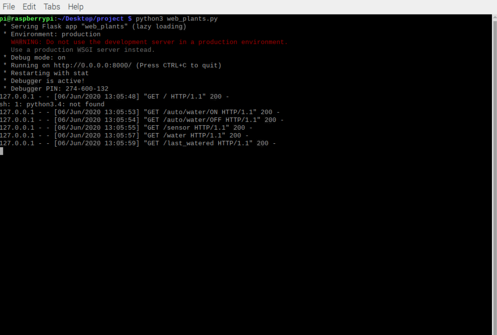

# Plant_watering_system
## Overview
This project is designed to automate watering for the plant in backyard.I have used raspberry pi4 modelB as a server which generates a html page where user can access the page from mobilephone or laptop and can set the watering mode to automatic or manual and can visualize the last watered time and date in the webpage.
## Dependencies
- flask
- raspberrypi (with rasbiean installed)
- Soilmoisture sensor
- 5V Relay
- 3-6V Mini Micro Submersible Pump
- 5v Power Supply
## Wiring

## Usage
Once dependencies are installed, just run this to see it in your browser.
> sudo python web_plants.py

## Output

